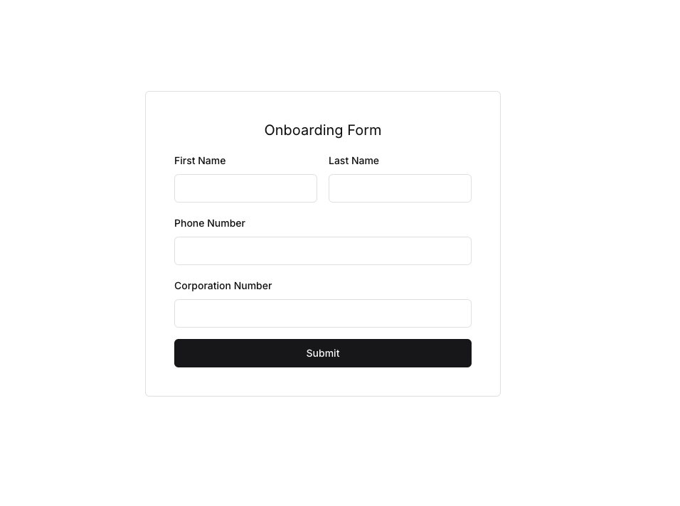
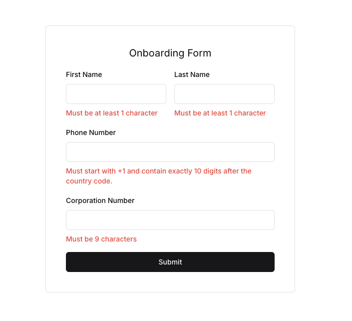
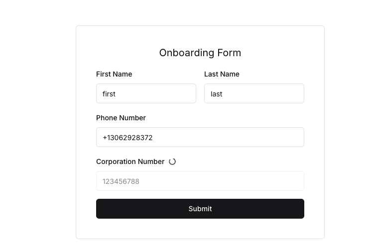
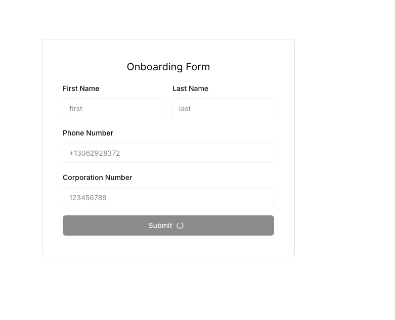
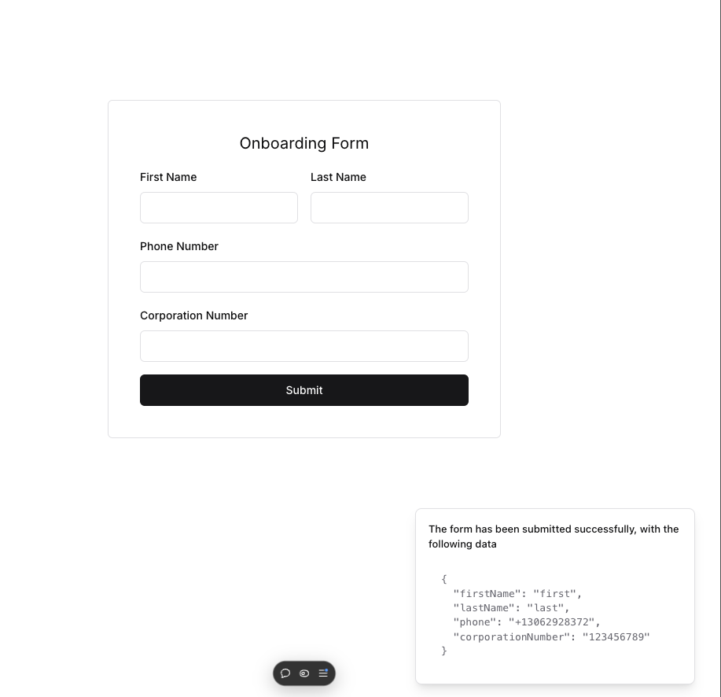
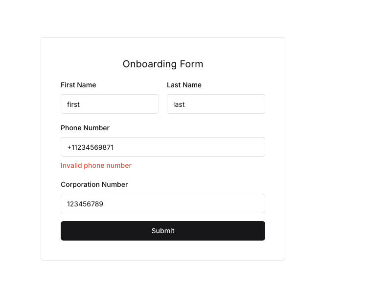

# vault-frontend

This is a Next.js application. It is deployed on

https://vault-frontend-five.vercel.app/

To test locally, clone the repo and run

```
npm install
npm run dev
```

To run the tests, run

```
npm run test
```

## Structure

- The main component is `OnboardingForm`, located in [./components/onboarding-form.tsx](./components/onboarding-form.tsx).

- The test file is located in [./components/onboarding-form.test.tsx](./components/onboarding-form.test.tsx).

- The application looks like this:



## Error handling and form validation

- If **Submit** is clicked right away without any inputs:



- Fields are validated on blur:



- When the form is submitted: the form is disabled and data is sent to the
  backend for validation:



- When the form is validated successfully: the form is cleared, a toast is shown:



- If there is a problem with validation from the backend, the respective field
  is indicated:



## Note

- We're not writing the test cases for invalid first name and invalid last name from the
backend. This is because the backend seems to always accepted any first and last names
as long as they're not empty (which we check in the frontend). However, we still do handle
these error cases.

- The UI/UX could be optimized some more.
